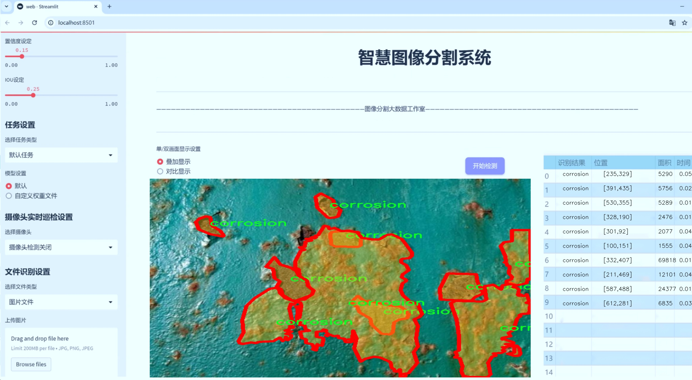
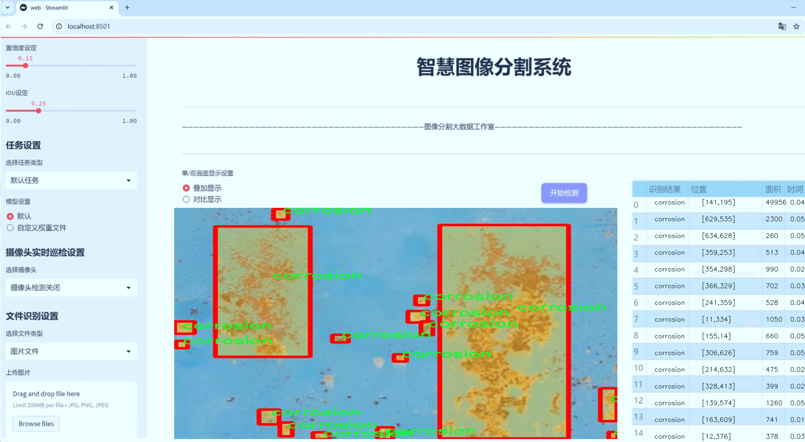
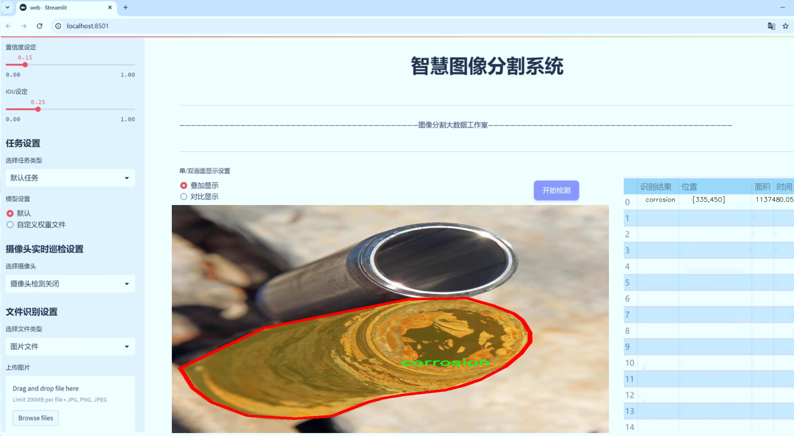
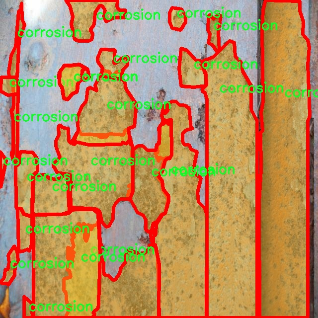
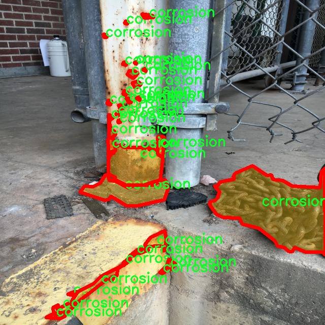
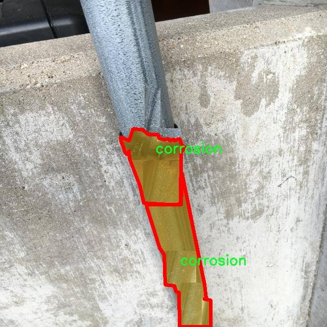
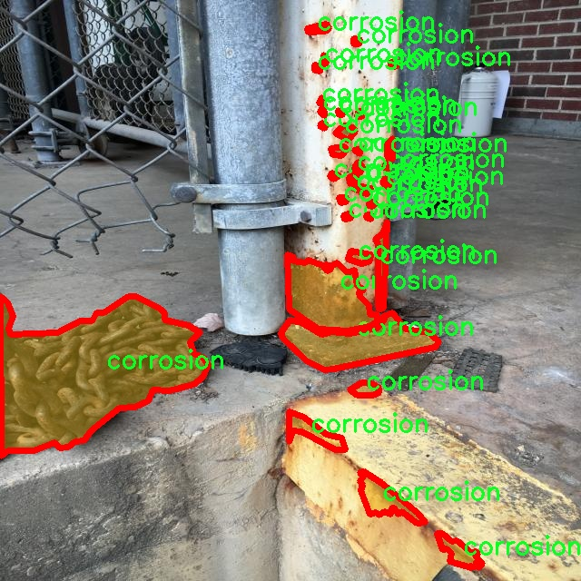
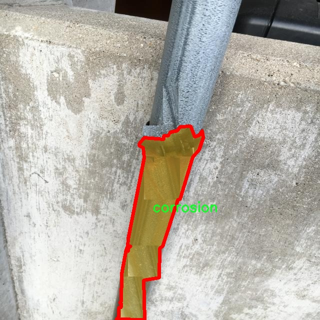

# 腐蚀图像分割系统源码＆数据集分享
 [yolov8-seg-C2f-DySnakeConv＆yolov8-seg-LSKNet等50+全套改进创新点发刊_一键训练教程_Web前端展示]

### 1.研究背景与意义

项目参考[ILSVRC ImageNet Large Scale Visual Recognition Challenge](https://gitee.com/YOLOv8_YOLOv11_Segmentation_Studio/projects)

项目来源[AAAI Global Al lnnovation Contest](https://kdocs.cn/l/cszuIiCKVNis)

研究背景与意义

随着工业化进程的加快，腐蚀问题已成为制约各类设施安全与耐用性的重要因素。腐蚀不仅影响了设备的使用寿命，还可能导致严重的安全隐患，给经济和社会带来巨大的损失。因此，针对腐蚀的检测与监测显得尤为重要。传统的腐蚀检测方法多依赖人工检查，效率低下且容易受到主观因素的影响。近年来，计算机视觉技术的迅猛发展为腐蚀检测提供了新的解决方案，尤其是深度学习在图像处理领域的应用，极大地提升了图像分析的准确性和效率。

YOLO（You Only Look Once）系列模型因其高效的实时目标检测能力而受到广泛关注。YOLOv8作为该系列的最新版本，进一步提升了模型的精度和速度，适用于多种复杂场景的目标检测与分割任务。然而，针对特定领域如腐蚀图像的分割，现有的YOLOv8模型仍存在一定的局限性，特别是在处理复杂背景和不同腐蚀类型时，模型的表现可能不尽如人意。因此，基于改进YOLOv8的腐蚀图像分割系统的研究具有重要的理论与实际意义。

本研究所使用的数据集“DatasetNew”包含1000幅腐蚀图像，专注于单一类别的腐蚀现象。这一数据集的构建为模型的训练与测试提供了良好的基础，能够有效支持腐蚀图像的实例分割任务。通过对这些图像的深入分析，我们可以提取出腐蚀的特征信息，进而为模型的改进提供数据支持。值得注意的是，数据集的规模虽然相对较小，但其专一性使得模型能够更集中地学习腐蚀特征，从而提升分割精度。

在技术层面，改进YOLOv8的腐蚀图像分割系统不仅能够实现对腐蚀区域的精准识别，还能够在实时监测中发挥重要作用。通过引入先进的图像处理技术和深度学习算法，系统能够自动化地识别和分割腐蚀区域，极大地提高了检测效率和准确性。这一系统的应用前景广泛，涵盖了桥梁、船舶、管道等多个领域，能够为工程维护提供有力支持，降低人工检测的成本和风险。

此外，本研究的意义还在于推动腐蚀检测领域的智能化进程。随着数据驱动技术的不断发展，基于深度学习的图像分割方法将成为未来腐蚀检测的主流趋势。通过对YOLOv8模型的改进与优化，我们不仅可以为腐蚀检测提供新的思路，还能为相关领域的研究提供借鉴和参考。总之，基于改进YOLOv8的腐蚀图像分割系统的研究，既是对现有技术的延续与创新，也是对工业安全与设备维护的重要贡献。

### 2.图片演示







##### 注意：由于此博客编辑较早，上面“2.图片演示”和“3.视频演示”展示的系统图片或者视频可能为老版本，新版本在老版本的基础上升级如下：（实际效果以升级的新版本为准）

  （1）适配了YOLOV8的“目标检测”模型和“实例分割”模型，通过加载相应的权重（.pt）文件即可自适应加载模型。

  （2）支持“图片识别”、“视频识别”、“摄像头实时识别”三种识别模式。

  （3）支持“图片识别”、“视频识别”、“摄像头实时识别”三种识别结果保存导出，解决手动导出（容易卡顿出现爆内存）存在的问题，识别完自动保存结果并导出到tempDir中。

  （4）支持Web前端系统中的标题、背景图等自定义修改，后面提供修改教程。

  另外本项目提供训练的数据集和训练教程,暂不提供权重文件（best.pt）,需要您按照教程进行训练后实现图片演示和Web前端界面演示的效果。

### 3.视频演示

[3.1 视频演示](https://www.bilibili.com/video/BV1gBSEYeEM8/)

### 4.数据集信息展示

##### 4.1 本项目数据集详细数据（类别数＆类别名）

nc: 1
names: ['corrosion']


##### 4.2 本项目数据集信息介绍

数据集信息展示

在本研究中，我们采用了名为“DatasetNew”的数据集，以训练和改进YOLOv8-seg模型在腐蚀图像分割任务中的表现。该数据集专门针对腐蚀现象的图像数据进行了精心的收集和标注，旨在为计算机视觉领域的腐蚀检测提供高质量的训练样本。数据集的类别数量为1，唯一的类别名称为“corrosion”，这表明该数据集专注于腐蚀这一特定的图像特征。

“DatasetNew”数据集的构建过程遵循了严格的标准，以确保数据的多样性和代表性。数据集中的图像涵盖了多种不同类型的腐蚀现象，包括但不限于金属表面的锈蚀、混凝土的剥落、涂层的脱落等。这些图像不仅来自于实验室环境的控制拍摄，还包括了实际应用场景中的真实案例，如工业设备、建筑物和基础设施等。这种多样化的图像来源使得模型在训练过程中能够学习到更广泛的腐蚀特征，从而提高其在实际应用中的鲁棒性和准确性。

为了确保数据集的标注质量，所有图像均经过专业人员的仔细审查和标注。每幅图像中腐蚀区域的边界被精确地标记出来，以便于模型能够学习到腐蚀的具体形态和特征。这种精细的标注方式不仅提升了数据集的使用价值，也为后续的模型训练提供了坚实的基础。通过对腐蚀区域的精确分割，YOLOv8-seg模型能够在处理新图像时，快速而准确地识别出腐蚀现象，从而实现高效的图像分割。

在数据集的使用过程中，我们还对图像进行了多种数据增强处理，包括旋转、缩放、翻转和颜色调整等。这些增强技术的应用旨在增加数据集的多样性，帮助模型更好地适应不同的输入条件和环境变化。通过这种方式，我们希望能够提升模型的泛化能力，使其在面对未知数据时依然能够保持较高的分割精度。

“DatasetNew”不仅为YOLOv8-seg模型的训练提供了丰富的图像数据，也为后续的研究和应用奠定了基础。随着腐蚀检测技术的不断发展，该数据集的价值将愈加凸显，成为相关领域研究者和工程师的重要资源。未来，我们期望通过对“DatasetNew”的进一步扩展和优化，能够持续推动腐蚀检测技术的进步，助力于工业安全和基础设施维护的智能化发展。











### 5.全套项目环境部署视频教程（零基础手把手教学）

[5.1 环境部署教程链接（零基础手把手教学）](https://www.bilibili.com/video/BV1jG4Ve4E9t/?vd_source=bc9aec86d164b67a7004b996143742dc)


[5.2 安装Python虚拟环境创建和依赖库安装视频教程链接（零基础手把手教学）](https://www.bilibili.com/video/BV1nA4VeYEze/?vd_source=bc9aec86d164b67a7004b996143742dc)

### 6.手把手YOLOV8-seg训练视频教程（零基础小白有手就能学会）

[6.1 手把手YOLOV8-seg训练视频教程（零基础小白有手就能学会）](https://www.bilibili.com/video/BV1cA4VeYETe/?vd_source=bc9aec86d164b67a7004b996143742dc)


按照上面的训练视频教程链接加载项目提供的数据集，运行train.py即可开始训练



     Epoch   gpu_mem       box       obj       cls    labels  img_size
     1/200     0G   0.01576   0.01955  0.007536        22      1280: 100%|██████████| 849/849 [14:42<00:00,  1.04s/it]
               Class     Images     Labels          P          R     mAP@.5 mAP@.5:.95: 100%|██████████| 213/213 [01:14<00:00,  2.87it/s]
                 all       3395      17314      0.994      0.957      0.0957      0.0843

     Epoch   gpu_mem       box       obj       cls    labels  img_size
     2/200     0G   0.01578   0.01923  0.007006        22      1280: 100%|██████████| 849/849 [14:44<00:00,  1.04s/it]
               Class     Images     Labels          P          R     mAP@.5 mAP@.5:.95: 100%|██████████| 213/213 [01:12<00:00,  2.95it/s]
                 all       3395      17314      0.996      0.956      0.0957      0.0845

     Epoch   gpu_mem       box       obj       cls    labels  img_size
     3/200     0G   0.01561    0.0191  0.006895        27      1280: 100%|██████████| 849/849 [10:56<00:00,  1.29it/s]
               Class     Images     Labels          P          R     mAP@.5 mAP@.5:.95: 100%|███████   | 187/213 [00:52<00:00,  4.04it/s]
                 all       3395      17314      0.996      0.957      0.0957      0.0845


### 7.50+种全套YOLOV8-seg创新点代码加载调参视频教程（一键加载写好的改进模型的配置文件）

[7.1 50+种全套YOLOV8-seg创新点代码加载调参视频教程（一键加载写好的改进模型的配置文件）](https://www.bilibili.com/video/BV1Hw4VePEXv/?vd_source=bc9aec86d164b67a7004b996143742dc)

### 8.YOLOV8-seg图像分割算法原理

原始YOLOv8-seg算法原理

YOLOv8-seg算法是YOLO系列模型中的最新版本，结合了目标检测和图像分割的功能，代表了计算机视觉领域的前沿技术。自2015年首次推出以来，YOLO模型经历了多个版本的迭代，逐步提升了推理速度、精度以及易用性。YOLOv8的设计理念旨在满足实时应用的需求，尤其是在复杂场景下的目标检测和分割任务中，展现出其独特的优势。

YOLOv8的网络结构由三个主要部分组成：Backbone（骨干网络）、Neck（颈部结构）和Head（头部结构）。其中，Backbone负责特征提取，Neck用于特征融合，而Head则负责最终的检测和分割输出。YOLOv8的Backbone采用了C2F模块，这一模块相较于之前版本的C3模块进行了优化，增加了更多的并行梯度流分支，能够在保证轻量化的同时获取更丰富的特征信息。这种设计使得YOLOv8在处理不同尺度的目标时，能够更加高效地提取特征，提升了模型的整体性能。

在Neck部分，YOLOv8摒弃了YOLOv5中的多次上采样操作，直接对Backbone不同阶段输出的特征进行上采样。这一变化不仅简化了网络结构，还提高了特征融合的效率，使得不同层次的特征能够更好地协同工作，从而增强了模型对复杂场景的适应能力。

YOLOv8的Head部分则是其创新的核心所在。与以往的Coupled-Head（耦合头）结构不同，YOLOv8采用了Decoupled-Head（解耦头）结构，将目标检测和分类任务分开处理。这样的设计使得模型在进行目标定位和类别预测时，可以更加专注于各自的任务，从而提高了预测的准确性。此外，YOLOv8摒弃了传统的Anchor-Based（基于锚框）方法，转而采用Anchor-Free（无锚框）策略。这一转变使得模型不再依赖于预设的锚框，从而降低了计算复杂度，并增强了模型的灵活性，尤其是在处理不同尺寸和形状的目标时，能够展现出更强的泛化能力。

在损失函数的设计上，YOLOv8也进行了重要的改进。它取消了原有的Objectness分支，采用了更为简化的损失计算方式，结合了二值交叉熵损失和分布焦点损失。这一设计旨在使得模型在训练过程中能够更快地聚焦于目标区域，提高了模型的收敛速度和精度。

YOLOv8的输入处理也展现出其灵活性。默认的输入图像尺寸为640x640，但在实际应用中，YOLOv8能够自适应地对不同长宽比的图像进行缩放和填充，最大限度地减少信息冗余。此外，YOLOv8在训练过程中引入了Mosaic图像增强技术，通过将多张图像随机拼接成一张训练样本，迫使模型学习不同位置和背景下的目标特征，从而提升了模型的鲁棒性和准确性。

在实际应用中，YOLOv8-seg算法的优势愈发明显。它不仅在目标检测任务中表现出色，还能有效地进行图像分割，满足了多种应用场景的需求。通过对网络结构的优化和算法的创新，YOLOv8-seg在处理复杂场景、提高推理速度和精度方面均有显著提升，成为了计算机视觉领域中不可或缺的工具。

总的来说，YOLOv8-seg算法通过一系列的结构优化和功能增强，展现了其在目标检测和图像分割任务中的强大能力。其灵活的网络设计、创新的损失函数以及高效的特征处理方式，使得YOLOv8-seg在实际应用中能够应对各种挑战，成为当前计算机视觉领域的领先者。随着技术的不断进步，YOLOv8-seg将继续推动目标检测和图像分割技术的发展，为各行各业带来更多的可能性。


### 9.系统功能展示（检测对象为举例，实际内容以本项目数据集为准）

图9.1.系统支持检测结果表格显示

  图9.2.系统支持置信度和IOU阈值手动调节

  图9.3.系统支持自定义加载权重文件best.pt(需要你通过步骤5中训练获得)

  图9.4.系统支持摄像头实时识别

  图9.5.系统支持图片识别

  图9.6.系统支持视频识别

  图9.7.系统支持识别结果文件自动保存

  图9.8.系统支持Excel导出检测结果数据


### 10.50+种全套YOLOV8-seg创新点原理讲解（非科班也可以轻松写刊发刊，V11版本正在科研待更新）

#### 10.1 由于篇幅限制，每个创新点的具体原理讲解就不一一展开，具体见下列网址中的创新点对应子项目的技术原理博客网址【Blog】：


[10.1 50+种全套YOLOV8-seg创新点原理讲解链接](https://gitee.com/qunmasj/good)

#### 10.2 部分改进模块原理讲解(完整的改进原理见上图和技术博客链接)【如果此小节的图加载失败可以通过CSDN或者Github搜索该博客的标题访问原始博客，原始博客图片显示正常】
### YOLOv8简介
YOLO（You Only Look Once）是一种流行的对象检测和图像分割模型，由华盛顿大学的Joseph Redmon和Ali Farhadi开发。YOLO于2015年推出，以其高速度和高精度迅速走红。

YOLOv2于2016年发布，通过合并批处理规范化、锚盒和维度集群来改进原始模型
2018年推出的YOLOv3使用更高效的骨干网络、多个锚点和空间金字塔池进一步增强了该模型的性能
YOLOv4于2020年发布，引入了Mosaic数据增强、新的无锚检测头和新的丢失功能等创新
YOLOv5进一步提高了模型的性能，并添加了超参数优化、集成实验跟踪和自动导出到流行导出格式等新功能
YOLOv6于2022年由美团开源，目前正在该公司的许多自动配送机器人中使用
YOLOv7在COCO关键点数据集上添加了额外的任务，如姿态估计
YOLOv8是Ultralytics公司推出的YOLO的最新版本。作为一款尖端、最先进的（SOTA）车型，YOLOv8在之前版本的成功基础上，引入了新的功能和改进，以增强性能、灵活性和效率。YOLOv8支持全方位的视觉AI任务，包括检测、分割、姿态估计、跟踪和分类。这种多功能性允许用户在不同的应用程序和域中利用YOLOv8的功能
#### YOLOv8的新特性与可用模型

Ultralytics 并没有直接将开源库命名为 YOLOv8，而是直接使用 ultralytics 这个词，原因是 ultralytics 将这个库定位为算法框架，而非某一个特定算法，一个主要特点是可扩展性。其希望这个库不仅仅能够用于 YOLO 系列模型，而是能够支持非 YOLO 模型以及分类分割姿态估计等各类任务。总而言之，ultralytics 开源库的两个主要优点是：

融合众多当前 SOTA 技术于一体
未来将支持其他 YOLO 系列以及 YOLO 之外的更多算法
Ultralytics为YOLO模型发布了一个全新的存储库。它被构建为 用于训练对象检测、实例分割和图像分类模型的统一框架。

提供了一个全新的 SOTA 模型，包括 P5 640 和 P6 1280 分辨率的目标检测网络和基于 YOLACT 的实例分割模型。和 YOLOv5 一样，基于缩放系数也提供了 N/S/M/L/X 尺度的不同大小模型，用于满足不同场景需求
骨干网络和 Neck 部分可能参考了 YOLOv7 ELAN 设计思想，将 YOLOv5 的 C3 结构换成了梯度流更丰富的 C2f 结构，并对不同尺度模型调整了不同的通道数，属于对模型结构精心微调，不再是无脑一套参数应用所有模型，大幅提升了模型性能。不过这个 C2f 模块中存在 Split 等操作对特定硬件部署没有之前那么友好了
Head 部分相比 YOLOv5 改动较大，换成了目前主流的解耦头结构，将分类和检测头分离，同时也从 Anchor-Based 换成了 Anchor-Free
Loss 计算方面采用了 TaskAlignedAssigner 正样本分配策略，并引入了 Distribution Focal Loss
训练的数据增强部分引入了 YOLOX 中的最后 10 epoch 关闭 Mosiac 增强的操作，可以有效地提升精度
YOLOv8 还高效灵活地支持多种导出格式，并且该模型可以在 CPU 和 GPU 上运行。YOLOv8 模型的每个类别中有五个模型用于检测、分割和分类。YOLOv8 Nano 是最快和最小的，而 YOLOv8 Extra Large (YOLOv8x) 是其中最准确但最慢的。


### FocalModulation模型的基本原理
参考该博客，Focal Modulation Networks（FocalNets）的基本原理是替换自注意力（Self-Attention）模块，使用焦点调制（focal modulation）机制来捕捉图像中的长距离依赖和上下文信息。下图是自注意力和焦点调制两种方法的对比。


自注意力要求对每个查询令牌（Query Token）与其他令牌进行复杂的查询-键（Query-Key）交互和查询-值（Query-Value）聚合，以计算注意力分数并捕捉上下文。而焦点调制则先将空间上下文以不同粒度聚合到调制器中，然后以查询依赖的方式将这些调制器注入到查询令牌中。焦点调制简化了交互和聚合操作，使其更轻量级。在图中，自注意力部分使用红色虚线表示查询-键交互和黄色虚线表示查询-值聚合，而焦点调制部分则用蓝色表示调制器聚合和黄色表示查询-调制器交互。 

FocalModulation模型通过以下步骤实现：

1. 焦点上下文化：用深度卷积层堆叠来编码不同范围的视觉上下文。


2. 门控聚合：通过门控机制，选择性地将上下文信息聚合到每个查询令牌的调制器中。


3. 逐元素仿射变换：将聚合后的调制器通过仿射变换注入到每个查询令牌中。

下面来分别介绍这三个机制->

#### 焦点上下文化
焦点上下文化（Focal Contextualization）是焦点调制（Focal Modulation）的一个组成部分。焦点上下文化使用一系列深度卷积层（depth-wise convolutional layers）来编码不同范围内的视觉上下文信息。这些层可以捕捉从近处到远处的视觉特征，从而允许网络在不同层次上理解图像内容。通过这种方式，网络能够在聚合上下文信息时保持对局部细节的敏感性，并增强对全局结构的认识。


​

这张图详细比较了自注意力（Self-Attention, SA）和焦点调制（Focal Modulation）的机制，并特别展示了焦点调制中的上下文聚合过程。左侧的图展示了自注意力模型如何通过键（k）和查询（q）之间的交互，以及随后的聚合来生成输出。而中间和右侧的图说明了焦点调制如何通过层级化的上下文聚合和门控聚合过程替代自注意力模型的这一过程。在焦点调制中，输入首先通过轻量级线性层进行处理，然后通过层级化的上下文化模块和门控机制来选择性地聚合信息，最终通过调制器与查询（q）进行交互以生成输出。

#### 门控聚合
在Focal Modulation Networks（FocalNets）中的 "门控聚合"（Gated Aggregation）是关键组件之一，这一过程涉及使用门控机制来选择性地聚合上下文信息。以下是这个过程的详细分析：

1. 什么是门控机制？
门控机制在深度学习中常用于控制信息流。它通常用于决定哪些信息应该被传递，哪些应该被阻断。在循环神经网络（RNN）中，特别是在长短期记忆网络（LSTM）和门控循环单元（GRU）中，门控机制用于调节信息在时间序列数据中的流动。

2. 门控聚合的目的
在FocalNets中，门控聚合的目的是为每个查询令牌（即处理中的数据单元）选择性地聚合上下文信息。这意味着网络能够决定哪些特定的上下文信息对于当前处理的查询令牌是重要的，从而专注于那些最相关的信息。

3. 如何实现门控聚合？
实现门控聚合可能涉及一系列计算步骤，其中包括：

计算上下文信息：这可能涉及使用深度卷积层（如文中提到的）对输入图像的不同区域进行编码，以捕捉从局部到全局的视觉上下文。
门控操作：这一步骤涉及到一个决策过程，根据当前查询令牌的特征来决定哪些上下文信息是相关的。这可能通过一个学习到的权重（门）来实现，该权重决定了不同上下文信息的重要性。
信息聚合：最后，根据门控操作的结果，选择性地聚合上下文信息到一个调制器中。这个调制器随后被用于调整或“调制”查询令牌的表示。
4. 门控聚合的好处
通过门控聚合，FocalNets能够更有效地聚焦于对当前任务最关键的信息。这种方法提高了模型的效率和性能，因为它减少了不必要信息的处理，同时增强了对关键特征的关注。在视觉任务中，这可能意味着更好的目标检测和图像分类性能，特别是在复杂或多变的视觉环境中。

总结：门控聚合是FocalNets的一个核心组成部分，它通过选择性地集中处理重要的上下文信息来提升网络的效率和性能。

#### 逐元素仿射变换
在Focal Modulation Networks（FocalNets）中的第三个关键组件是逐元素仿射变换，这个步骤涉及将通过门控聚合得到的调制器注入到每个查询令牌中。以下是该过程的详细分析：

1. 仿射变换的基本概念：
仿射变换是一种线性变换，用于对数据进行缩放、旋转、平移和倾斜等操作。在深度学习中，逐元素的仿射变换通常指的是对每个元素进行线性变换，这种变换可以被描述为y = ax + b，其中x是输入，y是输出，a和b是变换的参数。

2. 逐元素仿射变换的作用：
在FocalNets中，逐元素仿射变换的作用是将聚合后的调制器信息注入到每个查询令牌中。这个步骤对于整合上下文信息和查询令牌的原始特征非常重要。通过这种方式，调制器所包含的上下文信息可以直接影响查询令牌的表示。

3. 执行仿射变换：
执行这一步骤时，聚合后的调制器对每个查询令牌进行逐元素的仿射变换。在实践中，这可能意味着对查询令牌的每个特征应用调制器中的相应权重（a）和偏差（b）。这样，调制器中的每个元素都直接对应于查询令牌的一个特征，通过调整这些特征来改变其表达。

4. 仿射变换的效果：
通过逐元素仿射变换，模型能够更细致地调整每个查询令牌的特征，根据上下文信息来增强或抑制某些特征。这种精细的调整机制允许网络更好地适应复杂的视觉场景，提高对细节的捕捉能力，从而提升了模型在各种视觉任务中的性能，如目标检测和图像分类。

总结：逐元素仿射变换它使得模型能够利用上下文信息来有效地调整查询令牌，增强了模型对关键视觉特征的捕捉和表达能力。


### 11.项目核心源码讲解（再也不用担心看不懂代码逻辑）

#### 11.1 ultralytics\nn\backbone\VanillaNet.py

以下是对代码的核心部分进行提炼和详细注释的结果：

```python
import torch
import torch.nn as nn
import torch.nn.functional as F
from timm.layers import weight_init

# 定义激活函数类，继承自ReLU
class Activation(nn.ReLU):
    def __init__(self, dim, act_num=3, deploy=False):
        super(Activation, self).__init__()
        self.deploy = deploy  # 是否为部署模式
        # 初始化权重和偏置
        self.weight = torch.nn.Parameter(torch.randn(dim, 1, act_num * 2 + 1, act_num * 2 + 1))
        self.bias = None
        self.bn = nn.BatchNorm2d(dim, eps=1e-6)  # 批归一化
        self.dim = dim
        self.act_num = act_num
        weight_init.trunc_normal_(self.weight, std=.02)  # 权重初始化

    def forward(self, x):
        # 前向传播
        if self.deploy:
            return F.conv2d(
                super(Activation, self).forward(x), 
                self.weight, self.bias, padding=(self.act_num * 2 + 1) // 2, groups=self.dim)
        else:
            return self.bn(F.conv2d(
                super(Activation, self).forward(x),
                self.weight, padding=self.act_num, groups=self.dim))

    def switch_to_deploy(self):
        # 切换到部署模式，融合BN层
        if not self.deploy:
            kernel, bias = self._fuse_bn_tensor(self.weight, self.bn)
            self.weight.data = kernel
            self.bias = torch.nn.Parameter(torch.zeros(self.dim))
            self.bias.data = bias
            self.__delattr__('bn')  # 删除BN层
            self.deploy = True

    def _fuse_bn_tensor(self, weight, bn):
        # 融合卷积层和BN层的权重
        kernel = weight
        running_mean = bn.running_mean
        running_var = bn.running_var
        gamma = bn.weight
        beta = bn.bias
        eps = bn.eps
        std = (running_var + eps).sqrt()
        t = (gamma / std).reshape(-1, 1, 1, 1)
        return kernel * t, beta + (0 - running_mean) * gamma / std

# 定义基本块
class Block(nn.Module):
    def __init__(self, dim, dim_out, act_num=3, stride=2, deploy=False):
        super().__init__()
        self.deploy = deploy
        # 根据是否部署选择不同的卷积层
        if self.deploy:
            self.conv = nn.Conv2d(dim, dim_out, kernel_size=1)
        else:
            self.conv1 = nn.Sequential(
                nn.Conv2d(dim, dim, kernel_size=1),
                nn.BatchNorm2d(dim, eps=1e-6),
            )
            self.conv2 = nn.Sequential(
                nn.Conv2d(dim, dim_out, kernel_size=1),
                nn.BatchNorm2d(dim_out, eps=1e-6)
            )
        # 池化层
        self.pool = nn.MaxPool2d(stride) if stride != 1 else nn.Identity()
        self.act = Activation(dim_out, act_num)  # 激活函数

    def forward(self, x):
        # 前向传播
        if self.deploy:
            x = self.conv(x)
        else:
            x = self.conv1(x)
            x = F.leaky_relu(x, negative_slope=1)  # 使用Leaky ReLU
            x = self.conv2(x)

        x = self.pool(x)  # 池化
        x = self.act(x)   # 激活
        return x

    def switch_to_deploy(self):
        # 切换到部署模式，融合卷积和BN层
        if not self.deploy:
            kernel, bias = self._fuse_bn_tensor(self.conv1[0], self.conv1[1])
            self.conv = self.conv2[0]
            self.conv.weight.data = kernel
            self.conv.bias.data = bias
            self.__delattr__('conv1')
            self.__delattr__('conv2')
            self.act.switch_to_deploy()
            self.deploy = True

# 定义VanillaNet模型
class VanillaNet(nn.Module):
    def __init__(self, in_chans=3, num_classes=1000, dims=[96, 192, 384, 768], 
                 drop_rate=0, act_num=3, strides=[2, 2, 2, 1], deploy=False):
        super().__init__()
        self.deploy = deploy
        # 初始化stem部分
        if self.deploy:
            self.stem = nn.Sequential(
                nn.Conv2d(in_chans, dims[0], kernel_size=4, stride=4),
                Activation(dims[0], act_num)
            )
        else:
            self.stem1 = nn.Sequential(
                nn.Conv2d(in_chans, dims[0], kernel_size=4, stride=4),
                nn.BatchNorm2d(dims[0], eps=1e-6),
            )
            self.stem2 = nn.Sequential(
                nn.Conv2d(dims[0], dims[0], kernel_size=1, stride=1),
                nn.BatchNorm2d(dims[0], eps=1e-6),
                Activation(dims[0], act_num)
            )

        self.stages = nn.ModuleList()
        for i in range(len(strides)):
            stage = Block(dim=dims[i], dim_out=dims[i + 1], act_num=act_num, stride=strides[i], deploy=deploy)
            self.stages.append(stage)

    def forward(self, x):
        # 前向传播
        if self.deploy:
            x = self.stem(x)
        else:
            x = self.stem1(x)
            x = F.leaky_relu(x, negative_slope=1)
            x = self.stem2(x)

        for stage in self.stages:
            x = stage(x)  # 通过每个Block
        return x

    def switch_to_deploy(self):
        # 切换到部署模式
        if not self.deploy:
            self.stem2[2].switch_to_deploy()
            self.deploy = True

# 更新模型权重
def update_weight(model_dict, weight_dict):
    idx, temp_dict = 0, {}
    for k, v in weight_dict.items():
        if k in model_dict.keys() and np.shape(model_dict[k]) == np.shape(v):
            temp_dict[k] = v
            idx += 1
    model_dict.update(temp_dict)
    print(f'loading weights... {idx}/{len(model_dict)} items')
    return model_dict

# 创建不同版本的VanillaNet模型
def vanillanet_5(pretrained='', **kwargs):
    model = VanillaNet(dims=[128 * 4, 256 * 4, 512 * 4, 1024 * 4], strides=[2, 2, 2], **kwargs)
    if pretrained:
        weights = torch.load(pretrained)['model_ema']
        model.load_state_dict(update_weight(model.state_dict(), weights))
    return model

# 其他版本的创建函数类似...

if __name__ == '__main__':
    inputs = torch.randn((1, 3, 640, 640))  # 输入数据
    model = vanillanet_10()  # 创建模型
    pred = model(inputs)  # 进行预测
    for i in pred:
        print(i.size())  # 输出每层的尺寸
```

### 代码核心部分分析：
1. **Activation类**：自定义的激活函数类，包含了卷积和批归一化的融合逻辑。
2. **Block类**：表示网络中的基本块，包含卷积层、池化层和激活函数的组合。
3. **VanillaNet类**：整个网络的结构，包含stem部分和多个Block的组合。
4. **权重更新函数**：用于加载预训练模型的权重。
5. **模型创建函数**：用于创建不同配置的VanillaNet模型。

### 主要功能：
- 该代码实现了一个卷积神经网络（VanillaNet），支持动态切换到部署模式，优化了推理速度。
- 通过自定义的激活函数和基本块结构，提高了模型的灵活性和可扩展性。

这个文件是一个深度学习模型的实现，名为 `VanillaNet`，它主要用于图像处理任务，如图像分类。文件中包含了模型的定义、不同版本的模型构建函数以及一些辅助函数。

首先，文件的开头包含版权信息和许可证声明，说明该程序是开源的，可以在MIT许可证下进行修改和分发。

接下来，文件导入了必要的库，包括 PyTorch 及其神经网络模块、功能模块，以及一些用于权重初始化的工具和 NumPy。`__all__` 列表定义了该模块中可以被外部访问的对象。

`activation` 类是一个自定义的激活函数类，继承自 `nn.ReLU`。它在初始化时创建了一个可学习的权重和偏置，并使用批量归一化来提高模型的稳定性。`forward` 方法定义了前向传播的过程，支持两种模式：部署模式和训练模式。在部署模式下，激活函数的输出会经过卷积操作，而在训练模式下，则会进行批量归一化。

`Block` 类是模型的基本构建块，包含两个卷积层和一个激活函数。它的构造函数允许选择是否使用自适应池化。`forward` 方法定义了输入数据如何通过这个块进行处理。

`VanillaNet` 类是整个网络的主体，包含多个 `Block` 组成的阶段。它的构造函数接受输入通道数、类别数、每个阶段的通道数、丢弃率、激活函数数量、步幅等参数。根据这些参数，构建了一个多阶段的网络结构。`forward` 方法实现了输入数据的前向传播，并在不同的尺度上提取特征。

文件中还定义了一些函数，如 `update_weight`，用于更新模型的权重。`vanillanet_5` 到 `vanillanet_13_x1_5_ada_pool` 函数则是不同版本的 `VanillaNet` 模型构建函数，可以根据需要创建不同结构的模型，并可选择加载预训练权重。

最后，在文件的主程序部分，创建了一个随机输入并实例化了 `vanillanet_10` 模型，进行了一次前向传播，输出每个特征图的尺寸。

整体来看，这个文件实现了一个灵活且可扩展的深度学习模型，适用于各种图像处理任务，并且提供了多种模型变体以满足不同的需求。

#### 11.2 ultralytics\models\fastsam\val.py

以下是代码中最核心的部分，并附上详细的中文注释：

```python
# 导入必要的模块
from ultralytics.models.yolo.segment import SegmentationValidator
from ultralytics.utils.metrics import SegmentMetrics

class FastSAMValidator(SegmentationValidator):
    """
    自定义验证类，用于在Ultralytics YOLO框架中进行快速SAM（Segment Anything Model）分割。

    该类扩展了SegmentationValidator类，专门定制了快速SAM的验证过程。它将任务设置为'segment'，
    并使用SegmentMetrics进行评估。此外，为了避免在验证过程中出现错误，禁用了绘图功能。
    """

    def __init__(self, dataloader=None, save_dir=None, pbar=None, args=None, _callbacks=None):
        """
        初始化FastSAMValidator类，将任务设置为'segment'，并将指标设置为SegmentMetrics。

        参数：
            dataloader (torch.utils.data.DataLoader): 用于验证的数据加载器。
            save_dir (Path, optional): 保存结果的目录。
            pbar (tqdm.tqdm): 用于显示进度的进度条。
            args (SimpleNamespace): 验证器的配置。
            _callbacks (dict): 存储各种回调函数的字典。

        注意：
            在此类中禁用了ConfusionMatrix和其他相关指标的绘图，以避免错误。
        """
        # 调用父类的初始化方法
        super().__init__(dataloader, save_dir, pbar, args, _callbacks)
        
        # 设置任务类型为'segment'
        self.args.task = 'segment'
        
        # 禁用绘图功能，以避免在验证过程中出现错误
        self.args.plots = False
        
        # 初始化指标为SegmentMetrics，保存结果的目录为save_dir
        self.metrics = SegmentMetrics(save_dir=self.save_dir, on_plot=self.on_plot)
```

### 代码核心部分解释：
1. **类定义**：`FastSAMValidator`类继承自`SegmentationValidator`，用于快速SAM的分割验证。
2. **初始化方法**：在初始化时，设置任务类型为分割，并禁用绘图功能以避免错误，同时初始化评估指标为`SegmentMetrics`。

这个程序文件是一个自定义的验证类，名为 `FastSAMValidator`，它继承自 `SegmentationValidator`，主要用于在 Ultralytics YOLO 框架中进行快速分割模型（Segment Anything Model，简称 SAM）的验证。该类的设计目的是针对快速 SAM 的特定需求定制验证过程。

在类的文档字符串中，首先说明了这个类的功能和目的。它将任务设置为“分割”，并使用 `SegmentMetrics` 进行评估。此外，为了避免在验证过程中出现错误，类中禁用了绘图功能。

类的构造函数 `__init__` 接受多个参数，包括数据加载器、结果保存目录、进度条对象、配置参数以及回调函数的字典。构造函数首先调用父类的构造函数来初始化继承的属性，然后将任务类型设置为“segment”，并禁用绘图功能。最后，它还初始化了 `SegmentMetrics`，用于后续的性能评估。

总体来说，这个类为快速 SAM 模型的验证提供了一个专门的实现，确保在验证过程中能够有效地评估模型性能，同时避免因绘图功能导致的潜在错误。

#### 11.3 ultralytics\nn\extra_modules\__init__.py

以下是代码中最核心的部分，并对其进行了详细的中文注释：

```python
# 导入模块
from .afpn import *  # 导入自适应特征金字塔网络（AFPN）相关的功能
from .attention import *  # 导入注意力机制相关的功能
from .block import *  # 导入基础网络块的定义
from .head import *  # 导入网络头部的定义，通常用于分类或回归任务
from .rep_block import *  # 导入重复使用的网络块
from .kernel_warehouse import *  # 导入卷积核仓库的相关功能
from .dynamic_snake_conv import *  # 导入动态蛇形卷积的实现
from .orepa import *  # 导入OREPA（可能是某种特定的网络结构或方法）
from .RFAConv import *  # 导入RFA卷积（可能是某种特定的卷积方法）

# 以上代码通过相对导入的方式，将当前包中的多个模块导入到当前命名空间中。
# 这些模块可能包含网络结构、层、操作等，用于构建深度学习模型。
```

在这个代码片段中，所有的导入语句都是为了引入不同的模块和功能，这些模块可能是构建深度学习模型所需的各种组件。

这个程序文件 `__init__.py` 位于 `ultralytics\nn\extra_modules` 目录下，其主要功能是将该目录下的一些模块导入到包中。通过使用 `from .module_name import *` 的语法，文件将多个模块的内容暴露给外部，方便用户在使用这个包时可以直接访问这些模块中的类、函数或变量。

具体来说，这个文件导入了以下模块：

1. `afpn`：可能是实现了一种特定的特征金字塔网络（FPN）结构，用于增强图像特征的提取。
2. `attention`：通常与注意力机制相关，可能用于提高模型在处理信息时的重点关注能力。
3. `block`：可能定义了一些基本的构建块，用于构建更复杂的神经网络结构。
4. `head`：通常指的是网络的输出部分，可能包含分类或回归的逻辑。
5. `rep_block`：可能是指重复使用的网络块，通常用于构建深层网络。
6. `kernel_warehouse`：可能与卷积核的管理或生成有关。
7. `dynamic_snake_conv`：可能实现了一种动态的卷积操作，可能用于提高卷积神经网络的灵活性。
8. `orepa`：具体功能不明，可能是某种特定的网络结构或算法。
9. `RFAConv`：可能与某种特定的卷积操作或结构相关，RFA可能代表某种特定的算法或方法。

通过这个 `__init__.py` 文件，用户在导入 `extra_modules` 包时，可以直接使用这些模块中的功能，而无需单独导入每一个模块。这种设计提高了代码的可读性和可维护性，方便用户使用。

#### 11.4 ultralytics\models\sam\amg.py

以下是代码中最核心的部分，并附上详细的中文注释：

```python
import torch

def is_box_near_crop_edge(boxes: torch.Tensor,
                          crop_box: List[int],
                          orig_box: List[int],
                          atol: float = 20.0) -> torch.Tensor:
    """
    判断给定的边界框是否接近裁剪边缘。

    参数：
    - boxes: 需要检查的边界框，格式为 (N, 4)，其中 N 是边界框的数量，4 表示 (x1, y1, x2, y2)。
    - crop_box: 当前裁剪框的坐标 [x0, y0, x1, y1]。
    - orig_box: 原始图像的边界框坐标 [x0, y0, x1, y1]。
    - atol: 允许的绝对误差，默认为 20.0。

    返回：
    - 返回一个布尔张量，指示每个边界框是否接近裁剪边缘。
    """
    # 将裁剪框和原始框转换为张量
    crop_box_torch = torch.as_tensor(crop_box, dtype=torch.float, device=boxes.device)
    orig_box_torch = torch.as_tensor(orig_box, dtype=torch.float, device=boxes.device)
    
    # 将边界框从裁剪坐标系转换回原始坐标系
    boxes = uncrop_boxes_xyxy(boxes, crop_box).float()
    
    # 检查边界框是否接近裁剪框的边缘
    near_crop_edge = torch.isclose(boxes, crop_box_torch[None, :], atol=atol, rtol=0)
    # 检查边界框是否接近原始图像的边缘
    near_image_edge = torch.isclose(boxes, orig_box_torch[None, :], atol=atol, rtol=0)
    
    # 只有当边界框接近裁剪边缘且不接近原始图像边缘时，才返回 True
    near_crop_edge = torch.logical_and(near_crop_edge, ~near_image_edge)
    
    # 返回是否有任何边界框接近裁剪边缘
    return torch.any(near_crop_edge, dim=1)


def uncrop_boxes_xyxy(boxes: torch.Tensor, crop_box: List[int]) -> torch.Tensor:
    """
    将边界框从裁剪坐标系转换回原始坐标系。

    参数：
    - boxes: 需要转换的边界框，格式为 (N, 4)。
    - crop_box: 当前裁剪框的坐标 [x0, y0, x1, y1]。

    返回：
    - 返回转换后的边界框，格式为 (N, 4)。
    """
    x0, y0, _, _ = crop_box
    # 创建偏移量张量
    offset = torch.tensor([[x0, y0, x0, y0]], device=boxes.device)
    
    # 检查 boxes 是否有通道维度
    if len(boxes.shape) == 3:
        offset = offset.unsqueeze(1)
    
    # 返回加上偏移量后的边界框
    return boxes + offset


def batched_mask_to_box(masks: torch.Tensor) -> torch.Tensor:
    """
    计算掩膜周围的边界框，格式为 XYXY。

    参数：
    - masks: 输入掩膜，格式为 C1xC2x...xHxW。

    返回：
    - 返回边界框，格式为 C1xC2x...x4。
    """
    # 如果掩膜为空，返回 [0, 0, 0, 0]
    if torch.numel(masks) == 0:
        return torch.zeros(*masks.shape[:-2], 4, device=masks.device)

    # 将掩膜形状规范化为 CxHxW
    shape = masks.shape
    h, w = shape[-2:]
    masks = masks.flatten(0, -3) if len(shape) > 2 else masks.unsqueeze(0)
    
    # 获取边界框的上下边缘
    in_height, _ = torch.max(masks, dim=-1)
    in_height_coords = in_height * torch.arange(h, device=in_height.device)[None, :]
    bottom_edges, _ = torch.max(in_height_coords, dim=-1)
    in_height_coords = in_height_coords + h * (~in_height)
    top_edges, _ = torch.min(in_height_coords, dim=-1)

    # 获取边界框的左右边缘
    in_width, _ = torch.max(masks, dim=-2)
    in_width_coords = in_width * torch.arange(w, device=in_width.device)[None, :]
    right_edges, _ = torch.max(in_width_coords, dim=-1)
    in_width_coords = in_width_coords + w * (~in_width)
    left_edges, _ = torch.min(in_width_coords, dim=-1)

    # 如果掩膜为空，右边缘会在左边缘的左侧，替换这些边界框为 [0, 0, 0, 0]
    empty_filter = (right_edges < left_edges) | (bottom_edges < top_edges)
    out = torch.stack([left_edges, top_edges, right_edges, bottom_edges], dim=-1)
    out = out * (~empty_filter).unsqueeze(-1)

    # 返回到原始形状
    return out.reshape(*shape[:-2], 4) if len(shape) > 2 else out[0]
```

### 代码核心部分说明：
1. **`is_box_near_crop_edge`**: 该函数用于判断给定的边界框是否接近裁剪区域的边缘，返回一个布尔张量，指示哪些边界框接近裁剪边缘。
2. **`uncrop_boxes_xyxy`**: 该函数将裁剪坐标系中的边界框转换回原始图像坐标系，适用于后续的处理。
3. **`batched_mask_to_box`**: 该函数根据给定的掩膜计算其边界框，返回边界框的坐标，适用于目标检测等任务。

这个程序文件 `amg.py` 是一个与图像处理和计算机视觉相关的模块，主要用于处理与图像分割和边界框（bounding box）相关的操作。以下是对文件中各个部分的详细说明。

首先，文件导入了一些必要的库，包括数学库、迭代工具、类型提示、NumPy 和 PyTorch。PyTorch 是一个流行的深度学习框架，提供了对张量操作的支持。

文件中定义了多个函数，每个函数的功能各不相同：

1. **is_box_near_crop_edge**：该函数用于判断给定的边界框是否接近裁剪边缘。它接收边界框、裁剪框和原始框的坐标，并通过比较它们的距离来返回一个布尔张量，指示哪些边界框接近裁剪边缘。

2. **batch_iterator**：这个生成器函数用于从输入参数中生成批次数据。它确保所有输入参数的长度相同，并根据指定的批次大小将数据分成多个批次进行迭代。

3. **calculate_stability_score**：该函数计算一组掩膜的稳定性得分。稳定性得分是通过对预测掩膜的二值化掩膜进行交并比（IoU）计算得出的，反映了掩膜在不同阈值下的一致性。

4. **build_point_grid**：生成一个二维网格，网格中的点均匀分布在 [0,1] x [0,1] 的范围内，适用于图像处理中的采样或特征点生成。

5. **build_all_layer_point_grids**：为所有裁剪层生成点网格，考虑到不同层的缩放比例。

6. **generate_crop_boxes**：根据输入图像的大小、层数和重叠比例生成不同大小的裁剪框。每一层的裁剪框数量与层数相关，并考虑重叠区域。

7. **uncrop_boxes_xyxy**：该函数用于将裁剪框的坐标转换为原始图像坐标，通过添加裁剪框的偏移量来实现。

8. **uncrop_points**：类似于 `uncrop_boxes_xyxy`，但用于处理点的坐标，将其从裁剪坐标转换为原始图像坐标。

9. **uncrop_masks**：该函数用于将掩膜从裁剪区域扩展到原始图像大小，通过填充来实现。

10. **remove_small_regions**：用于去除掩膜中小的、不连通的区域或孔洞。该函数利用 OpenCV 的连通组件分析功能，能够根据给定的面积阈值进行处理。

11. **batched_mask_to_box**：计算掩膜周围的边界框，返回的格式为 XYXY。该函数处理掩膜为空的情况，并返回相应的边界框。

整个模块的设计旨在为图像分割任务提供支持，尤其是在处理裁剪和掩膜时，能够有效地进行边界框的生成和调整。通过这些函数，用户可以在图像处理过程中进行灵活的操作，以满足不同的需求。

#### 11.5 ultralytics\utils\loss.py

以下是代码中最核心的部分，并附上详细的中文注释：

```python
import torch
import torch.nn as nn
import torch.nn.functional as F

class BboxLoss(nn.Module):
    def __init__(self, reg_max, use_dfl=False):
        """初始化 BboxLoss 模块，设置最大正则化值和是否使用 DFL（Distribution Focal Loss）."""
        super().__init__()
        self.reg_max = reg_max  # 最大正则化值
        self.use_dfl = use_dfl  # 是否使用 DFL
        self.nwd_loss = False  # 是否使用 Wasserstein 距离损失
        self.iou_ratio = 0.5  # IoU 比例

    def forward(self, pred_dist, pred_bboxes, anchor_points, target_bboxes, target_scores, target_scores_sum, fg_mask):
        """计算边界框损失."""
        weight = target_scores.sum(-1)[fg_mask].unsqueeze(-1)  # 计算权重
        iou = bbox_iou(pred_bboxes[fg_mask], target_bboxes[fg_mask], xywh=False, CIoU=True)  # 计算 IoU
        loss_iou = ((1.0 - iou) * weight).sum() / target_scores_sum  # IoU 损失

        # 如果启用 Wasserstein 距离损失
        if self.nwd_loss:
            nwd = wasserstein_loss(pred_bboxes[fg_mask], target_bboxes[fg_mask])  # 计算 Wasserstein 距离
            nwd_loss = ((1.0 - nwd) * weight).sum() / target_scores_sum  # Wasserstein 损失
            loss_iou = self.iou_ratio * loss_iou + (1 - self.iou_ratio) * nwd_loss  # 综合损失

        # 如果使用 DFL
        if self.use_dfl:
            target_ltrb = bbox2dist(anchor_points, target_bboxes, self.reg_max)  # 将目标边界框转换为分布
            loss_dfl = self._df_loss(pred_dist[fg_mask].view(-1, self.reg_max + 1), target_ltrb[fg_mask]) * weight  # 计算 DFL 损失
            loss_dfl = loss_dfl.sum() / target_scores_sum  # DFL 损失归一化
        else:
            loss_dfl = torch.tensor(0.0).to(pred_dist.device)  # 如果不使用 DFL，损失为 0

        return loss_iou, loss_dfl  # 返回 IoU 损失和 DFL 损失

    @staticmethod
    def _df_loss(pred_dist, target):
        """计算 Distribution Focal Loss."""
        tl = target.long()  # 目标左边界
        tr = tl + 1  # 目标右边界
        wl = tr - target  # 左边权重
        wr = 1 - wl  # 右边权重
        return (F.cross_entropy(pred_dist, tl.view(-1), reduction='none').view(tl.shape) * wl +
                F.cross_entropy(pred_dist, tr.view(-1), reduction='none').view(tl.shape) * wr).mean(-1, keepdim=True)  # 返回 DFL 损失

class v8DetectionLoss:
    """计算检测损失的类."""

    def __init__(self, model):
        """初始化 v8DetectionLoss，设置模型相关属性和 BCE 损失函数."""
        device = next(model.parameters()).device  # 获取模型设备
        h = model.args  # 超参数

        m = model.model[-1]  # 获取 Detect() 模块
        self.bce = nn.BCEWithLogitsLoss(reduction='none')  # 初始化 BCE 损失
        self.hyp = h  # 超参数
        self.stride = m.stride  # 模型步幅
        self.nc = m.nc  # 类别数量
        self.reg_max = m.reg_max  # 最大正则化值
        self.device = device  # 设备

        self.bbox_loss = BboxLoss(m.reg_max - 1, use_dfl=True).to(device)  # 初始化边界框损失

    def __call__(self, preds, batch):
        """计算损失并返回."""
        loss, batch_size = self.compute_loss(preds, batch)  # 计算损失
        return loss.sum() * batch_size, loss.detach()  # 返回总损失和分离的损失

    def compute_loss(self, preds, batch):
        """计算边界框、类别和 DFL 的损失总和."""
        loss = torch.zeros(3, device=self.device)  # 初始化损失数组
        pred_distri, pred_scores = preds  # 获取预测分布和预测分数

        # 计算目标
        targets = torch.cat((batch['batch_idx'].view(-1, 1), batch['cls'].view(-1, 1), batch['bboxes']), 1)  # 合并目标
        gt_labels, gt_bboxes = targets.split((1, 4), 2)  # 分割目标标签和边界框

        # 计算预测边界框
        pred_bboxes = self.bbox_decode(pred_distri)  # 解码预测边界框

        # 计算边界框损失
        if fg_mask.sum():
            loss[0], loss[2] = self.bbox_loss(pred_distri, pred_bboxes, target_bboxes, target_scores, target_scores_sum, fg_mask)  # 计算边界框损失

        # 计算类别损失
        loss[1] = self.bce(pred_scores, target_scores.to(dtype)).sum() / target_scores_sum  # 计算 BCE 损失

        return loss  # 返回损失

```

### 代码说明：
1. **BboxLoss 类**：用于计算边界框的损失，包括 IoU 损失和可选的 DFL（Distribution Focal Loss）。
   - `forward` 方法：计算损失，包括 IoU 和 DFL。
   - `_df_loss` 方法：计算 DFL 损失。

2. **v8DetectionLoss 类**：用于计算检测任务的总损失。
   - `__init__` 方法：初始化损失计算类，设置模型和损失函数。
   - `__call__` 方法：计算损失并返回。
   - `compute_loss` 方法：计算边界框损失和类别损失。

以上代码是 YOLOv8 模型损失计算的核心部分，负责处理边界框和类别的损失计算。

这个程序文件是一个用于计算损失函数的模块，主要用于Ultralytics YOLO（You Only Look Once）模型的训练。文件中定义了多个损失类，分别用于不同的任务，如目标检测、实例分割和关键点检测等。以下是对文件中主要内容的逐步说明。

首先，文件导入了必要的PyTorch库和一些辅助函数，这些函数用于计算损失、处理边界框、生成锚点等。接着，定义了多个损失类，每个类都有其特定的功能。

`SlideLoss`类实现了一种滑动损失函数，它通过对每个元素应用损失函数来计算最终损失。它根据给定的IoU（Intersection over Union）阈值调整损失的权重，从而使得模型在训练过程中能够更好地关注于那些IoU较低的样本。

`EMASlideLoss`类是`SlideLoss`的扩展，增加了指数移动平均（EMA）机制。它在训练过程中动态调整IoU的平均值，从而使得损失计算更加灵活和适应性强。

`VarifocalLoss`类实现了一种变焦损失函数，主要用于目标检测任务。它通过加权二元交叉熵损失来增强模型对难以分类样本的关注。

`FocalLoss`类是另一种损失函数，旨在解决类别不平衡问题。它通过调整损失的权重来减少易分类样本的影响，从而使模型更加关注难以分类的样本。

`BboxLoss`类用于计算边界框的损失。它结合了IoU损失和分布焦点损失（DFL），以提高边界框回归的精度。该类还支持使用不同的IoU计算方法，如CIoU和MPDIoU。

`KeypointLoss`类用于计算关键点检测的损失。它根据预测的关键点和真实的关键点之间的欧几里得距离来计算损失，并考虑关键点的可见性。

`v8DetectionLoss`类是一个综合性的损失计算类，结合了目标检测的各种损失函数。它负责处理模型的输出，计算边界框损失、分类损失和DFL损失，并根据超参数调整各个损失的权重。

`v8SegmentationLoss`和`v8PoseLoss`类分别用于实例分割和姿态估计任务，扩展了`v8DetectionLoss`类的功能，增加了对分割和关键点的损失计算。

最后，`v8ClassificationLoss`类用于计算分类任务的损失，使用交叉熵损失函数来评估模型的分类性能。

整体来看，这个文件提供了一整套用于YOLO模型训练的损失计算方法，涵盖了目标检测、实例分割和关键点检测等多种任务，具有很高的灵活性和可扩展性。每个损失类都实现了特定的损失计算逻辑，能够适应不同的训练需求。

### 12.系统整体结构（节选）

### 整体功能和构架概括

Ultralytics 是一个用于计算机视觉任务的深度学习框架，特别是在目标检测、图像分割和关键点检测等领域。该框架的设计目标是提供高效、灵活且易于扩展的模型和工具，以便研究人员和开发者能够快速构建和训练他们的模型。

在这个框架中，各个模块和文件的功能相互配合，形成了一个完整的工作流：

- **模型定义**：如 `VanillaNet.py`，提供了基础的神经网络结构，支持不同的图像处理任务。
- **验证过程**：如 `val.py`，专门用于验证模型的性能，确保模型在训练后的有效性。
- **额外模块**：如 `__init__.py`，用于组织和导入其他模块，增强代码的可读性和可维护性。
- **图像处理和边界框管理**：如 `amg.py`，提供了处理裁剪、掩膜和边界框的工具，支持分割任务。
- **损失计算**：如 `loss.py`，实现了多种损失函数，用于优化模型训练过程，确保模型能够有效学习。

### 文件功能整理表

| 文件路径                                           | 功能描述                                               |
|---------------------------------------------------|--------------------------------------------------------|
| `ultralytics\nn\backbone\VanillaNet.py`          | 定义了 VanillaNet 模型结构，支持图像分类和特征提取。 |
| `ultralytics\models\fastsam\val.py`              | 实现了快速 SAM 模型的验证过程，计算模型性能指标。    |
| `ultralytics\nn\extra_modules\__init__.py`      | 导入额外模块，提供模块的统一接口，增强可读性。        |
| `ultralytics\models\sam\amg.py`                  | 提供图像分割和边界框处理的工具，支持裁剪和掩膜管理。  |
| `ultralytics\utils\loss.py`                       | 实现多种损失函数，用于目标检测、分割和关键点检测等任务。 |

通过以上的模块和文件，Ultralytics 框架能够有效地支持各种计算机视觉任务，提供了灵活的模型架构和强大的工具集，方便用户进行深度学习研究和应用开发。

注意：由于此博客编辑较早，上面“11.项目核心源码讲解（再也不用担心看不懂代码逻辑）”中部分代码可能会优化升级，仅供参考学习，完整“训练源码”、“Web前端界面”和“50+种创新点源码”以“14.完整训练+Web前端界面+50+种创新点源码、数据集获取”的内容为准。

### 13.图片、视频、摄像头图像分割Demo(去除WebUI)代码

在这个博客小节中，我们将讨论如何在不使用WebUI的情况下，实现图像分割模型的使用。本项目代码已经优化整合，方便用户将分割功能嵌入自己的项目中。
核心功能包括图片、视频、摄像头图像的分割，ROI区域的轮廓提取、类别分类、周长计算、面积计算、圆度计算以及颜色提取等。
这些功能提供了良好的二次开发基础。

### 核心代码解读

以下是主要代码片段，我们会为每一块代码进行详细的批注解释：

```python
import random
import cv2
import numpy as np
from PIL import ImageFont, ImageDraw, Image
from hashlib import md5
from model import Web_Detector
from chinese_name_list import Label_list

# 根据名称生成颜色
def generate_color_based_on_name(name):
    ......

# 计算多边形面积
def calculate_polygon_area(points):
    return cv2.contourArea(points.astype(np.float32))

...
# 绘制中文标签
def draw_with_chinese(image, text, position, font_size=20, color=(255, 0, 0)):
    image_pil = Image.fromarray(cv2.cvtColor(image, cv2.COLOR_BGR2RGB))
    draw = ImageDraw.Draw(image_pil)
    font = ImageFont.truetype("simsun.ttc", font_size, encoding="unic")
    draw.text(position, text, font=font, fill=color)
    return cv2.cvtColor(np.array(image_pil), cv2.COLOR_RGB2BGR)

# 动态调整参数
def adjust_parameter(image_size, base_size=1000):
    max_size = max(image_size)
    return max_size / base_size

# 绘制检测结果
def draw_detections(image, info, alpha=0.2):
    name, bbox, conf, cls_id, mask = info['class_name'], info['bbox'], info['score'], info['class_id'], info['mask']
    adjust_param = adjust_parameter(image.shape[:2])
    spacing = int(20 * adjust_param)

    if mask is None:
        x1, y1, x2, y2 = bbox
        aim_frame_area = (x2 - x1) * (y2 - y1)
        cv2.rectangle(image, (x1, y1), (x2, y2), color=(0, 0, 255), thickness=int(3 * adjust_param))
        image = draw_with_chinese(image, name, (x1, y1 - int(30 * adjust_param)), font_size=int(35 * adjust_param))
        y_offset = int(50 * adjust_param)  # 类别名称上方绘制，其下方留出空间
    else:
        mask_points = np.concatenate(mask)
        aim_frame_area = calculate_polygon_area(mask_points)
        mask_color = generate_color_based_on_name(name)
        try:
            overlay = image.copy()
            cv2.fillPoly(overlay, [mask_points.astype(np.int32)], mask_color)
            image = cv2.addWeighted(overlay, 0.3, image, 0.7, 0)
            cv2.drawContours(image, [mask_points.astype(np.int32)], -1, (0, 0, 255), thickness=int(8 * adjust_param))

            # 计算面积、周长、圆度
            area = cv2.contourArea(mask_points.astype(np.int32))
            perimeter = cv2.arcLength(mask_points.astype(np.int32), True)
            ......

            # 计算色彩
            mask = np.zeros(image.shape[:2], dtype=np.uint8)
            cv2.drawContours(mask, [mask_points.astype(np.int32)], -1, 255, -1)
            color_points = cv2.findNonZero(mask)
            ......

            # 绘制类别名称
            x, y = np.min(mask_points, axis=0).astype(int)
            image = draw_with_chinese(image, name, (x, y - int(30 * adjust_param)), font_size=int(35 * adjust_param))
            y_offset = int(50 * adjust_param)

            # 绘制面积、周长、圆度和色彩值
            metrics = [("Area", area), ("Perimeter", perimeter), ("Circularity", circularity), ("Color", color_str)]
            for idx, (metric_name, metric_value) in enumerate(metrics):
                ......

    return image, aim_frame_area

# 处理每帧图像
def process_frame(model, image):
    pre_img = model.preprocess(image)
    pred = model.predict(pre_img)
    det = pred[0] if det is not None and len(det)
    if det:
        det_info = model.postprocess(pred)
        for info in det_info:
            image, _ = draw_detections(image, info)
    return image

if __name__ == "__main__":
    cls_name = Label_list
    model = Web_Detector()
    model.load_model("./weights/yolov8s-seg.pt")

    # 摄像头实时处理
    cap = cv2.VideoCapture(0)
    while cap.isOpened():
        ret, frame = cap.read()
        if not ret:
            break
        ......

    # 图片处理
    image_path = './icon/OIP.jpg'
    image = cv2.imread(image_path)
    if image is not None:
        processed_image = process_frame(model, image)
        ......

    # 视频处理
    video_path = ''  # 输入视频的路径
    cap = cv2.VideoCapture(video_path)
    while cap.isOpened():
        ret, frame = cap.read()
        ......
```


### 14.完整训练+Web前端界面+50+种创新点源码、数据集获取


# [下载链接：https://mbd.pub/o/bread/Zp6Zk5hw](https://mbd.pub/o/bread/Zp6Zk5hw)